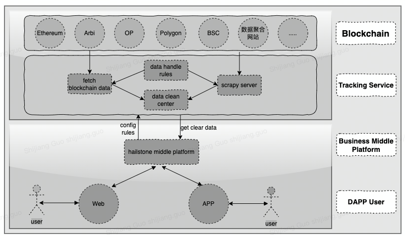

# NFT Data Monitoring and NFT Recommendation Product Design Doc (seek, Barrett,拉飞, luna, eren)

## 1. Overview
This product mainly grabs data on NFT contract creation, NFT minting, and NFT transactions, performs data analytics, and recommends high-value NFTs to users. Business rules include whale wallet address monitoring, monitoring of valuable NFT projects, monitoring of high-value individual NFTs, NFT value analysis, NFT rarity analysis, etc.

## 2. Architecture Design

Overall architecture:

### 1. Details of Rule Components

1.1. Whale Wallet Rules

Rule 1: Judge based on total value of holder’s NFTs + tokens (including past holdings). Different threshold values determine if whale.

Rule 2: Monitor addresses of exchanges, institutions, investors, large holders.

Clean data on identified whale addresses and push to data center for middleware.

1.2. Valuable NFT Project Rules

- Average NFT price > threshold

- Average circulation frequency > threshold

- Number of holding addresses > threshold

- Monitor minting and transactions of projects meeting rules. Identify new projects. Push data to center.

1.3. Valuable Individual NFT Rules

Circulation frequency > threshold
Recent N trades > value threshold
Price trend curve

Monitor trades of NFTs meeting rules. Push data to center.

1.4. Data Logic
Mint date
First trade date + price
Last trade date + price
Historical price curve + dates
NFT series info, meaning, brand story
NFT scarcity
Community fans
Turnover frequency
BTC price curve (plotted with NFT curve)
Market NFT volume + dates
Market NFT market cap + dates
![roi reference image]

## 3. Business Logic Details

1. Rule Configuration
![rule configuration diagram]

Call rule RPC  
--------------->
hailstone                   savour-nft【config rules】
          <---------------
               Return
See RPC API for details.

2. Data Cleansing
![data cleansing diagram]

Ingest cleansed data     Get cleansing rules  
---------->savour-nft【data center】 <-------------- savour-nft【config rules】
3. Data Ingestion Services
![data ingestion diagram]

              Whale addresses, NFT data etc.
Data aggregation sites-------------------------> Ingestion service
              
              Transaction data, contract creation, NFT transfers, holders etc.   
Blockchain ----------------------------------------------------> Monitoring service
4. Pushing Clean Data
![push clean data diagram]

            Call rule RPC
          --------------->
hailstone                   savour-nft【configured rules】
          <---------------
             Return clean data
See RPC API for details.

## Appendix 1 - Websites to Crawl

- Oklink: https://www.oklink.com/docs/en/#rest-api-address-top-100-richest-addresses

- Whale address site 1: https://dune.com/0xBi/0xBi

- polygonscan: https://polygonscan.com/labelcloud

- arbiscan: https://arbiscan.io/labelcloud

- etherscan: https://etherscan.io/labelcloud

## Appendix 2

- Wallet analytics reference: https://pro.nansen.ai/wallet-profiler

- Whale identification reference: https://nftgo.io/whale-tracking/list

- More data sources: https://www.chaineye.info/5/newsletter_detail
