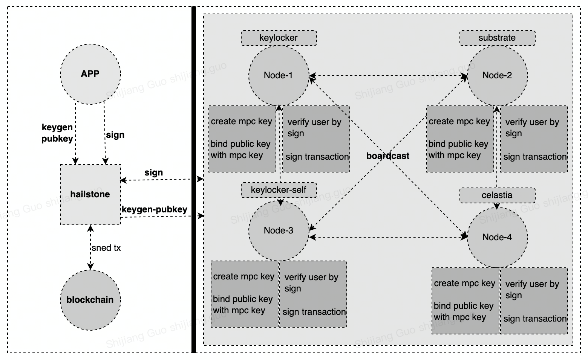
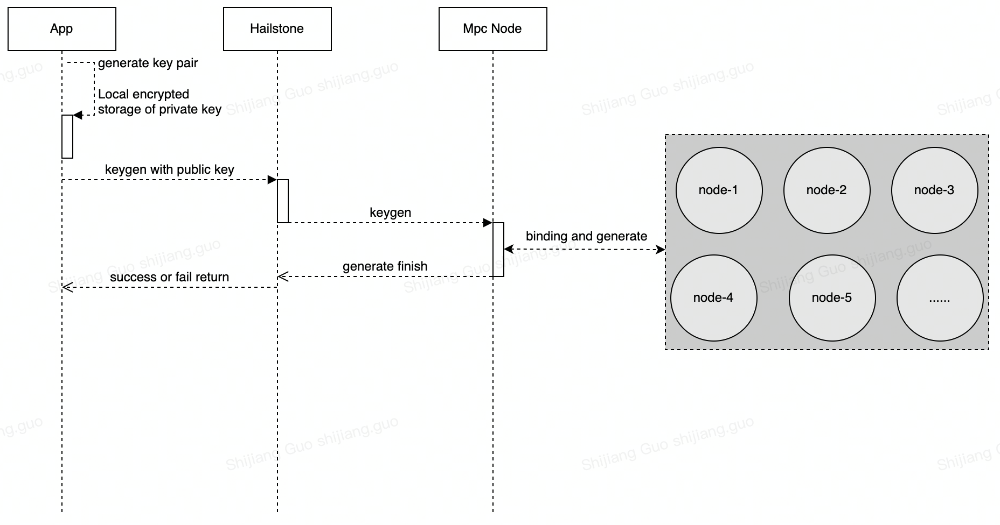
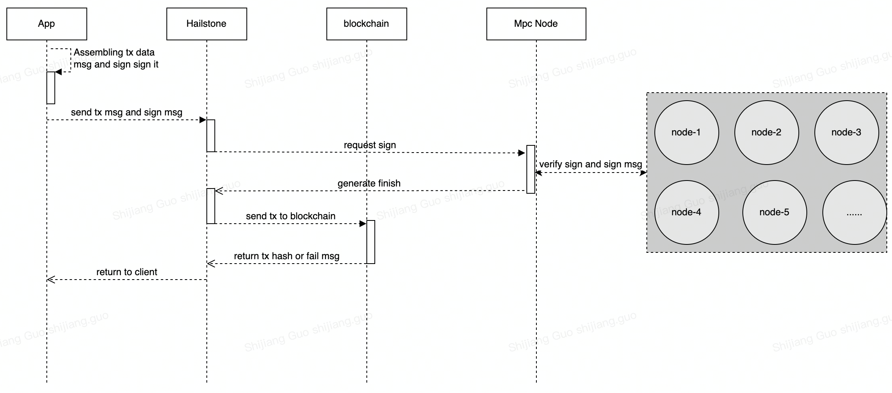

# MPC Wallet Technical Solution Document

## Overview

MPC is a multi-party computation method that allows each node to generate a key fragment. Each node independently manages the key fragment. Since the complete key has never appeared in the entire network, as long as the key fragment of the threshold node is not leaked, the wallet is safe.

MPC private key management is a relatively popular private key management solution. It requires at least three parties to participate to complete. Two-party calculation is meaningless; the more nodes involved, the safer it is. The advantage of this solution is to weaken the concept of private keys, with good user experience and high security. The disadvantage is that the security will be lower if the number of participating parties is small.

## Architecture Design

The overall project design architecture diagram is as follows:

- The APP sends a KeyGen request and gives its public key to hailstone. Hailstone broadcasts the PulicKey to all nodes. After the nodes receive the public key, they keygen.
- After keygen is completed, the public key and the private key fragment are bound to be used for verifying the signature when signing transactions later.
- The APP initiates a transaction, and hailstone schedules all nodes to sign. Before signing, first verify the signature. After the verification is passed, start signing.
- After the nodes sign, they give it to hailstone. Hailstone sends the transaction to the blockchain network and returns the transaction hash to the APP.

##  Implementation Details

1. Keygen Flowchart

2. Sign Flowchart

